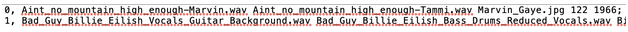
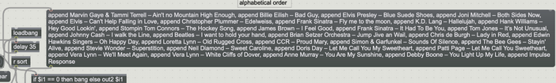

<h1>Creating Duets from Commercial Recordings</h1>

<h2><u>Overview:</u></h2>
Wav files that can be purchased on either Qobuz or Bandcamp or other places that sell Hi-Res music files (such as flac or wav files. If you choose to purchase flac files you will need to convert them into wav files before source separating them, and can do this in audacity – a free audio editing software that is plenty good enough for everything needed to do here).  

Next, and this may be challenging for some, is to install some form of python3. If needed, please follow an online guide instruction for how to do this. 

Here is a place to download python: https://www.python.org/downloads/ 

Here is a pretty good set of instructions for installing python onto either windows, mac, or linux: https://www.codecademy.com/article/install-python3 

Here is another set of instructions for linux: https://docs.python-guide.org/starting/install3/linux/ 

To use demucs, you will also need to install ffmpeg by typing in python: brew install ffmpeg 

Once you have installed python, please go into python (using terminal or whatever software you will be using) and follow the instructions in the demucs software for musicians at the link here: https://github.com/facebookresearch/demucs#for-musicians 

As the link states, to install this program, in python please type:  

`python3 -m pip install -U demucs `

Then, once demucs is installed, follow the instructions on this page: https://github.com/facebookresearch/demucs/blob/main/docs/mac.md 

As the link states, to run the program, please type:  

`python3 -m demucs -d cpu PATH_TO_AUDIO_FILE_1 `

You will need to replace `PATH_TO_AUDIO_FILE_1` with the name of the path to the audio file in your computer. On a mac you can do this by right-clicking on the file name, and once it has opened the list of commands, press the option key, which will bring up the option for copy ___ as Pathname. Choose this and insert it into the text above instead of `PATH_TO_AUDIO_FILE_1`

## Instructions
Audiofiles of songs can be separated, giving one player the vocals and some of the instruments, the rest of the instruments (and sometimes the other vocals) given to the other player. We have used a number of different methods for ‘source separation’, but the most recent method that we have been following is **Demucs Music Source Separation** (with instructions on how to use this above).  

Once made, the audio files need to be stored in the **MMM_Project\media** folder. Follow the instructions in section x to upload them into the Max patch. 

### **Song Library**

The song library is stored on textfiles outside of the patch and is referred to whenever a player opens the dropdown menu (listed as songlist-alphabetical.txt, songlist-year.txt, and songlist-tempo.txt). Here is an example from songlist-alphabetical.txt:

Entries other than the reference number (the first number which is followed by a comma) in this list are separated by spaces, and each line is separated by a semicolon (NB There needs to be an empty line after the final line or max cannot read the final semicolon and the final line is lost). In this file, each line lists its reference number, the audiofile for mbox1 (generally accompaniment), the audiofile for mbox2 (generally the melody), the opensource picture that covers over the screen, the average song tempo, and the year of recording. Other characteristics of each song can be added to this file, the number of characteristics just needs to be matched with the unpack function in the max patch. 

There are currently 3 versions of these textfiles. One that is in alphabetical order, one that is arranged according to year of performance, and one that is arranged according to average tempo of the song. Each of these files need to be adjusted when adding new songs. 

Also, in order to have the dropdown menu match these files, the **p titlebar** subpatch needs to be adjusted to match the order of these textfiles. The example below shows an example message for alphabetical order. 
