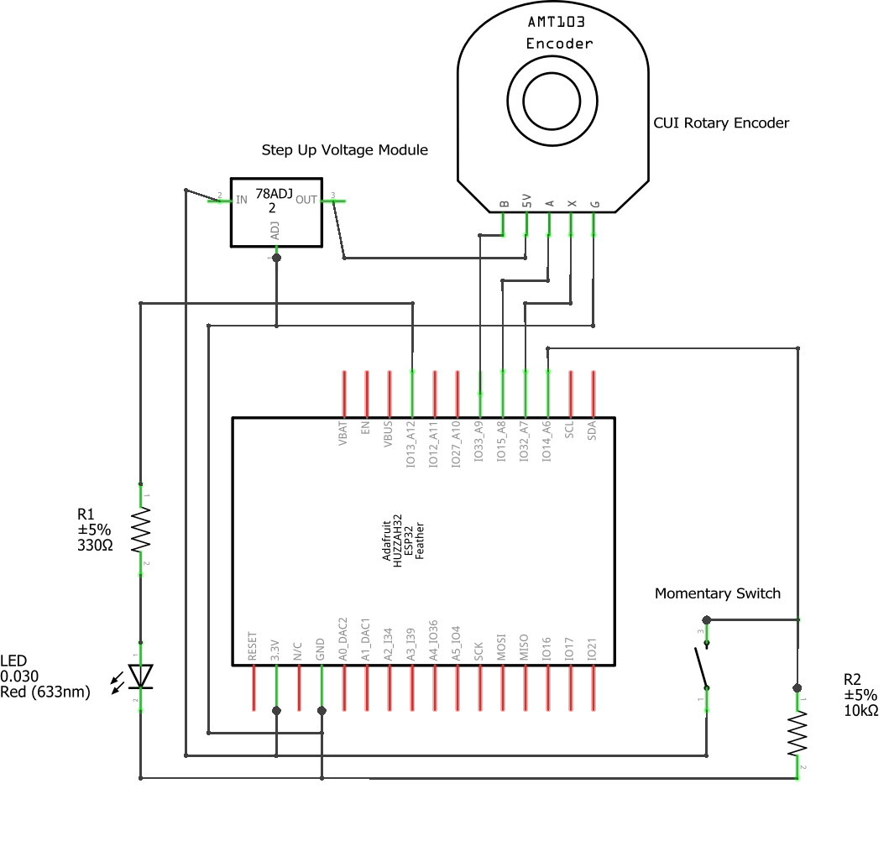
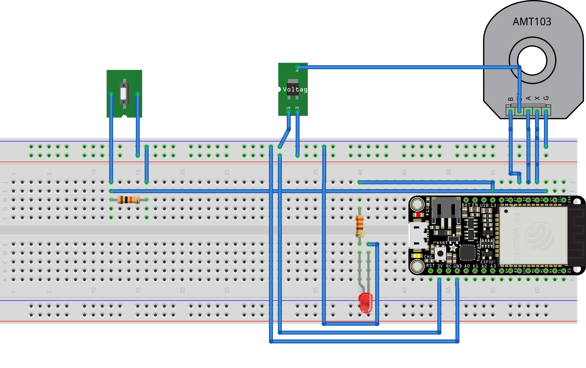

<h1>MMM Duet System</h1>
<h2>MMM Duet System Hardware</h2>

<h3><u>Overview:</u></h3>
Here are the steps to follow to build the hardware for the MMM Duet System.
<ol>
<li>Purchase items in the Shopping List file.</li>
<li>Use a 3D printer to print the components.</li>
<li>Put the hardware together by following the steps in the Assembly Instructions file.</li>
</ol>

<h3>A. Shopping List</h3>

This list is for 2 devices
<h4><b>Parts</b><h4>

1. (2) Adafruit Huzzah32 – ESP32 Feather Board (pre-soldered) (https://www.digikey.ca/en/products/detail/adafruit-industries-llc/3591/8119805) This board is slightly more expensive than other ESP32 boards but it was chosen because it comes with a battery charger, JST connection, Wi-Fi and Bluetooth Classic/LE support all on one board. </li>

2. (2) Capacitive Rotary encoders https://www.digikey.ca/en/products/detail/cui-devices/amt103-v/827016

3. (2) 1/4in.(6.35mm)x85mm round metal rods. Note: Rod selection was based partly on availability in our area. For this reason, the holes in the 3D print model are designed to accommodate a 1/4in. (6.35mm) rod. The feel of the rotation can be affected if the gap between the base holes and the rod is too large, so we recommend adjusting the 3D print model to accommodate what is available in your area. The rotary encoders come with a variety of sleeve sizes and can accommodate a broad range of diameters.

4. (2) Protoboards and (4) headers (https://www.amazon.ca/dp/B07CK3RCKS/)

5. (2) Step Up Voltage Module 3.3V to 5V (https://www.amazon.ca/gp/product/B07MTH1R39/)

6. (2) 10K Ohms ±5% and (2) 330K Ohms, ½ Watt, ±5% tolerance, carbon film, resistors

7. (2) 3mm 3.0V-3.4V LED (https://www.amazon.ca/gp/product/B073GRZNRL/)

8. (2)  5 Position MTA 100 Connector Assembly, 22 AWG (https://www.digikey.ca/en/products/detail/te-connectivity-amp-connectors/3-640440-5/698281)

9. (4) Male and (4) Female Spade connectors (optional) (https://www.amazon.ca/gp/product/B08NWXTDN8/)

10. (2) 1000mAh (minimum) Lithium-ion polymer (Lipo) battery (be sure that the polarity of the JST connector matches this https://www.adafruit.com/product/258). There is room for slightly larger batteries, and the model can be modified to accommodate thicker battery packs.

11. (4) M3x8 and (4) M3x12 Hex Screw Bolts (https://www.amazon.ca/gp/product/B0734NVR48/) 

12. (2) M2.6x8 screws (https://www.amazon.ca/Screws-Nickel-Plated-Tapping-Phillips/dp/B0BYNM9522/)

13. (2) M3 Nylon Lock nut (https://www.amazon.ca/gp/product/B07GNH6FVM/)

14. (2) Momentary switches (https://www.amazon.ca/gp/product/B07DS8VSZ1/)

<h4><b>Supplies</b><h4>

15. 0.6mm Solder (https://www.amazon.ca/gp/product/B071XVPJVX/)  

16. Epoxy (https://www.amazon.ca/Gorilla-Epoxy-85-oz-Clear/dp/B001Z3C3AG/) 
</li> 

17. Filament (depends on printer and desired properties; we used https://us.polymaker.com/products/polylite-asa?variant=39574343221305)  
18. 22AWG Solid Core Wire (https://www.digikey.ca/en/products/detail/adafruit-industries-llc/1311/6198255)
19. Solder Seal Butt Connector (https://www.amazon.ca/NORJIN-Connectors-Waterproof-Electrical-Automotive/dp/B09WQWQQW9/)

<h4><b>Tools</b><h4>

15. Wire Crimper 
16. Voltage Meter (optional) 
17. Screwdriver that matches bolt/screws 
18. Hot glue gun (optional) 
19. Heat gun 

<h3>B. Assembly Instructions</h3>
<h4><b>Step 1: Load the Arduino sketch onto the ESP32 board. </b><h4>
Below is the wiring schematic. Rather than wire directly to the ESP32 board, we chose to wire to a set of headers soldered to a 30mmx70mm protoboard to prevent damaging the ESP32 board with any soldering mistakes and facilitate reuse of the ESP32 board within the lab.

#### Special considerations and recommendations:
* We terminated the ground and positive wires going to the momentary switch with a male spade connector to facilitate connection assembly (optional). Otherwise, the switch can be connected to the protoboard directly. 
* The LED is joined to the connecting wires with a solder seal butt connector. 
* Connecting the wires to MTA 100 Connector Assembly can be challenging. Rather than acquiring the specialized insertion tool, we used the spanner bit of our screwdriver set.
* We recommend using a volt meter to check conductivity with each connection. 

### Wiring Diagram

### Breadboard Diagram
The breadboard diagram below can be used to furhter facilitate conceptualizing of the wiring and testing prior to soldering. 
 

<table>
<tr>
<td width="40%">

</td>
<td width="60%">
<ul>
<li>(A) Cut handle to a length of no more than 85mm. Ensure no burs are present to ensure a smooth rotation. </li>
<li>(B) Apply a small amount of epoxy into the hole and quickly set the rod in place. </li>
<li>Let dry before continuing. </li>
<li>(C) Insert the nylon lock nut into the knob such that the hexagon side is towards the circular hole.  </li>
<li>(D) Insert M3x12 screw bolt through handle into knob(C). </li>
</ul>
</td>
</tr>
<tr>
<td width="40%">
</td>
<td width="60%">
<ul>
<li>Cut two pieces of wire about 80mm in length; strip both ends.</li>
<li>(A) Hook a wire through each eyelet of the button. </li>
<li>(B) Trim a solder seal butt connector so that the solder is placed where the wire loops onto itself and touches the eyelet.</li> 
<li>Use heat gun to seal butt connector </li>
<li>Repeat for other wire</li>
<li>(C) At the end of the wire, opposite of the button, connect, place a spade connector (female), crimp close and use the heat gun to seal. Optional, you can wire to the protoboard directly, but the wire would need to be cut if any changes would occur in the future. </li>
<li>Repeat for other wire </li>
<li>Remove washer if it is already on the button.</li>
<li>(D) Feed wires through the hole in the base and then through the washer</li>
<li>(E) Tighten washer</li>
</ul>
</td>
</tr>
<tr>
<td width="40%">
</td>
<td width="60%">
<ul>
<li>    Align rotary encoder base with the holes in the music box base. </li>
<li>    (A) Insert 2-M2.6x8 screws in two holes that fit snuggly.  </li>
<li>    (B) Align Handle Base (cylinder shape) with the holes in the base. </li> 
<li>    Insert 4-M3x8 screw bolts in the aligned holes </li>
</ul>
</td>
</tr>
<tr>
<td width="40%">
</td>
<td width="60%">
<ul>
<li>    Adjust the resolution of the encoder to the desired amount. Between 48 and 125 pulses per revolution. See the rotary encoder’s manufacturer’s documentation for more details.  </li>
</ul>
</td>
</tr>
<tr>
<td width="40%">
</td>
<td width="60%">
<ul>
<li>    Push handle as far as possible through the hole at the top of the base. </li>
<li>    (A) Place the coloured sleeve that matches the diameter of the rod approximately 1 mm from the printed model. See https://www.cuidevices.com/product/resource/amt10.pdf for the sleeve sizing guide. </li>
<li>    (B) Place black shaft adapter over the white sleeve. The rod should be difficult to remove at this point. If the sleeve needs to be adjusted remove the shaft adapter and then adjust the sleeve.  </li> 
<li>    (C) Gently clip the encoder into place. The black tabs of the encoder base break easily. </li>
</ul>
</td>
</tr>
<tr>
<td width="40%">
</td>
<td width="60%">
<ul>
<li>    (A) Connect button spade connectors of the protoboard to those of the ESP32. </li>
<li>    (B) Push LED light snuggly into hole </li>
<li>    (C) Connect battery pack to the ESP32 and place battery in pocket. </li> 
<li>    Seat ESP32 in the headers of the protoboard. </li>
<li>    Place protoboard in slot </li>
<li>    (D) Connect the 5 Position MTA 100 connector to the rotary encoder. </li>
<li>   (Optional) (E) Use hot glue gun to improve stability of protoboard and ease of installation. </li>
</ul>
</td>
</tr>
<tr>
<td width="40%">
</td>
<td width="60%">
<ul>
<li>Add bottom panel and screw into place with M3x12 bolt screws. </li>
</ul>
</td>
</tr>
<tr>
<td width="40%">
</td>
<td width="60%">
<ul>
<li>    Enjoy! </li>
</ul>
</td>
</tr>
</table>

