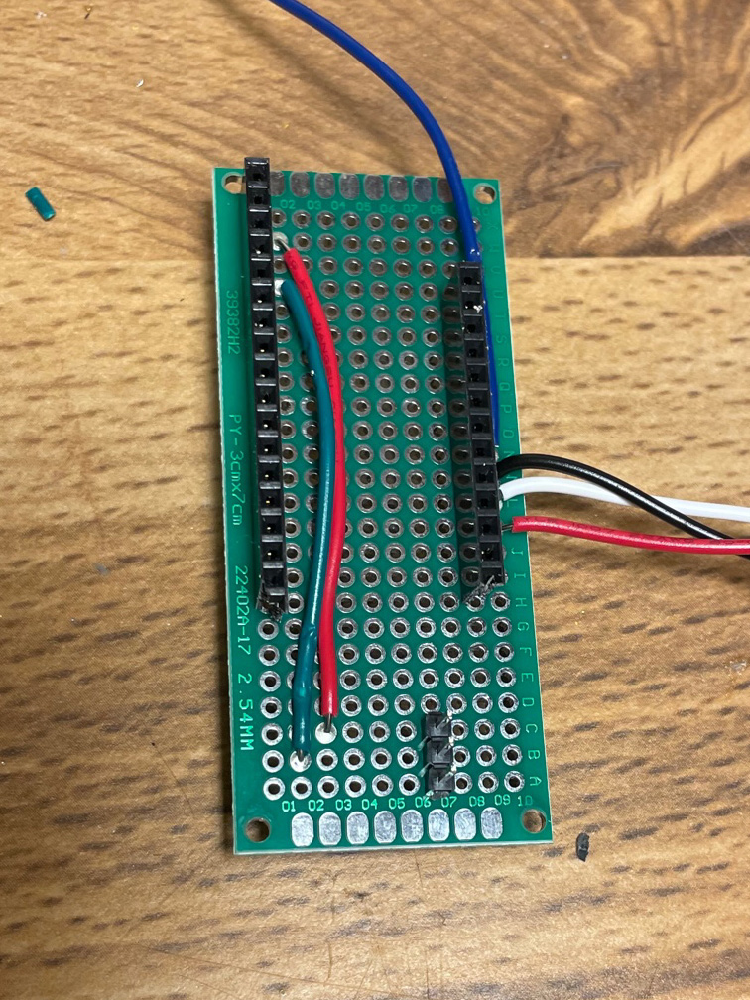
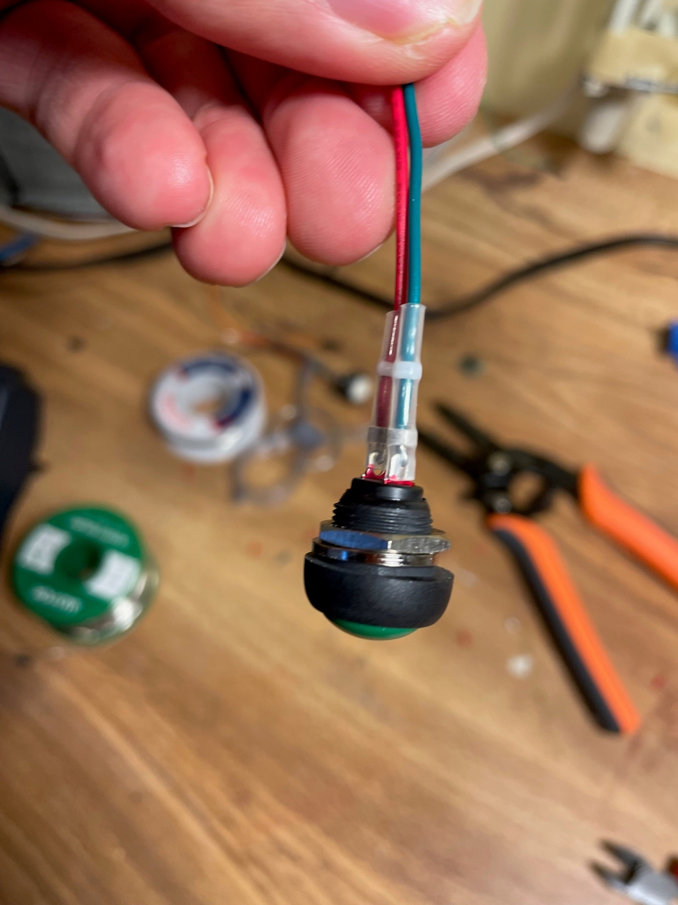

<h1>MMM Duet System Hardware</h1>
<h2><u>Important Files and Sections:</u></h2>

### 1. Shopping list (See section A Below)

### 2. 3D Printing Files (See subfolder Model Files)

These are the files you will need to 3D print the base and handle for each MMM Duet System device.

- Base: 2022_base_model (.f3z, .stl)
  - Component parts:
    - BaseBottom (.3mf, .obj, .stl)
    - BaseTop (.3mf, .obj, .stl)
    - HandleBase (.3mf, .obj, .stl)
- Handle: Crank50mm_solid(.f3z, .stl)
  - Component parts:
    - SolidHandle (.3mf, .obj, .stl)
    - Knob (.3mf, .obj, .stl)

### 3. Arduino Sketch (See subfolder Controller Files)

An Arduino ‘sketch’ is a file that contains the code that runs on an Arduino board (here, the ESP 32). This sketch needs to be loaded onto the Arduino board as detailed in Assembly Step 1.

### 4. Assembly Instructions (See section B Below)

## <u>Overview:</u>

Here are the steps to follow to build the hardware for the MMM Duet System.

<ol>
<li>Purchase items in the Shopping List file.</li>
<li>Use a 3D printer to print the components.</li>
<li>Put the hardware together by following the steps in the Assembly Instructions file.</li>
</ol>

<h2>A. Shopping List</h2>

This list is for 2 devices

### **Parts**

1. (2) Adafruit Huzzah32 – ESP32 Feather Board (pre-soldered) (https://www.digikey.ca/en/products/detail/adafruit-industries-llc/3591/8119805) This board is slightly more expensive than other ESP32 boards but it was chosen because it comes with a battery charger, JST connection, Wi-Fi and Bluetooth Classic/LE support all on one board. </li>
2. (2) Capacitive Rotary encoders https://www.digikey.ca/en/products/detail/cui-devices/amt103-v/827016
3. (2) 1/4in.(6.35mm)x85mm round metal rods. Note: Rod selection was based partly on availability in our area. For this reason, the holes in the 3D print model are designed to accommodate a 1/4in. (6.35mm) rod. The feel of the rotation can be affected if the gap between the base holes and the rod is too large, so we recommend adjusting the 3D print model to accommodate what is available in your area. The rotary encoders come with a variety of sleeve sizes and can accommodate a broad range of diameters.
4. (2) Protoboards and (4) headers (https://www.amazon.ca/dp/B07CK3RCKS/)
5. (2) Step Up Voltage Module 3.3V to 5V (https://www.amazon.ca/gp/product/B07MTH1R39/)
6. (2) 10K Ohms ±5% and (2) 330K Ohms, ½ Watt, ±5% tolerance, carbon film, resistors
7. (2) 3mm 3.0V-3.4V LED (https://www.amazon.ca/gp/product/B073GRZNRL/)
8. (2)  5 Position MTA 100 Connector Assembly, 22 AWG (https://www.digikey.ca/en/products/detail/te-connectivity-amp-connectors/3-640440-5/698281)
9. (4) Male and (4) Female Spade connectors (optional) (https://www.amazon.ca/gp/product/B08NWXTDN8/)
10. (2) 1000mAh (minimum) Lithium-ion polymer (Lipo) battery (be sure that the polarity of the JST connector matches this https://www.adafruit.com/product/258). There is room for slightly larger batteries, and the model can be modified to accommodate thicker battery packs.
11. (4) M3x8 and (4) M3x12 Hex Screw Bolts (https://www.amazon.ca/gp/product/B0734NVR48/) 
12. (2) M2.6x8 screws (https://www.amazon.ca/Screws-Nickel-Plated-Tapping-Phillips/dp/B0BYNM9522/)
13. (2) M3 Nylon Lock nut (https://www.amazon.ca/gp/product/B07GNH6FVM/)
14. (2) Momentary switches (https://www.amazon.ca/gp/product/B07DS8VSZ1/)

### <b>Supplies</b>

15. 0.6mm Solder (https://www.amazon.ca/gp/product/B071XVPJVX/)  
16. Epoxy (https://www.amazon.ca/Gorilla-Epoxy-85-oz-Clear/dp/B001Z3C3AG/)
17. Filament (depends on printer and desired properties; we used https://us.polymaker.com/products/polylite-asa?variant=39574343221305)  
18. 22AWG Solid Core Wire (https://www.digikey.ca/en/products/detail/adafruit-industries-llc/1311/6198255)
19. Solder Seal Butt Connector (https://www.amazon.ca/NORJIN-Connectors-Waterproof-Electrical-Automotive/dp/B09WQWQQW9/)

### <b>Tools</b>

20. Wire Crimper 
21. Voltage Meter (optional) 
22. Screwdriver that matches bolt/screws 
23. Hot glue gun (optional) 
24. Heat gun 

## B. Assembly Instructions

### **Step 1: Load the Arduino sketch onto the ESP32 board.**

The following instructions explain how to load the Arduino sketch onto the ESP32 Board. We used the Arduino IDE (Integrated Development Environment; see below) due to our familiarity with the software and broad community support.

1. **Install Drivers**
   To load the sketch onto the ESP32 board, you will need to establish a ‘serial connection’ with the board via a ‘COM’ port. To do so, download and install the necessary drivers onto the computer you will use to upload sketch to the board. For a detailed description please visit the manufacturer’s website:
   https://docs.espressif.com/projects/esp-idf/en/latest/esp32/get-started/establish-serial-connection.html

- CP210x Windows/Mac OSX Driver https://www.silabs.com/developers/usb-to-uart-bridge-vcp-drivers

- FTDI Chip VCP Driver https://ftdichip.com/drivers/vcp-drivers/

2. **Set up the Arduino IDE**

- Download and install the Arduino IDE (https://www.arduino.cc/en/software )

- Open the Arduino IDE software, then go to Tools and then Manage Libraries
- Search for and install these libraries:
  - Adafruit BusIO by Adafruit
  - ArduinoOSC by hidekital
- Add the board manager
  - Under File then Preferences, add the following in the text field for Additional Board Manager URLS:
    https://dl.espressif.com/dl/package_esp32_index.json, http://arduino.esp8266.com/stable/package_esp8266com_index.json

3. **‘Flash’ (Arduino’s term for ‘upload’) the sketch onto the board**

- Under Tools, select Board, then ESP32 Arduino, then Adafruit ESP32 Feather
- Plug the USB cable into the board and the computer that you are using to upload the sketch.  
  -Under Tools, select Port, and then select the appropriate COM port. To find the right port: - On PC, open the Device Manager and then expand Ports (COM & LPT). The correct port is listed as Silicon Labs CP210x USB to UART Bridge.

- (Optional) Change the name of the bluetooth controller to avoid confusion with two devices with the same name (e.g., to MMM_Box1).

- Under Sketch, select Upload to upload the sketch to the ESP32 board.

### **Step 2: Wiring**

Below is the wiring schematic. Rather than wire directly to the ESP32 board, we chose to wire to a set of headers soldered to a 30mmx70mm protoboard to prevent damaging the ESP32 board with any soldering mistakes and facilitate reuse of the ESP32 board within the lab. (See supplemental information for soldering instructions )

### Special considerations and recommendations:

- We terminated the ground and positive wires going to the momentary switch with a male spade connector to facilitate connection assembly (optional). Otherwise, the switch can be connected to the protoboard directly.
- The LED is joined to the connecting wires with a solder seal butt connector.
- Connecting the wires to MTA 100 Connector Assembly can be challenging. Rather than acquiring the specialized insertion tool, we used the spanner bit of our screwdriver set.
- We recommend using a volt meter to check conductivity with each connection.

#### **Wiring Diagram**

#### **Breadboard Diagram**

The breadboard diagram below can be used to furhter facilitate conceptualizing of the wiring and testing prior to soldering.

<h3><b>Step 3: Put all the pieces together</b></h3>
<table>
<tr valign="top"><td width="100%">Follow the instructions below to create each MMM Duet System controller.</td></tr>

<tr>
<td width="40%">

</td>
<td width="60%">
<ul>
<li>(A) Cut rod to a length of no more than 85mm. Ensure no burs are present to ensure a smooth rotation. </li>
<li>(B) Apply a small amount of epoxy into the hole and quickly set the rod in place. </li>
<li>Let dry before continuing. </li>
<li>(C) Insert the nylon lock nut into the knob such that the hexagon side is towards the circular hole.  </li>
<li>(D) Insert M3x12 screw bolt through handle into knob(C). </li>
</ul>
</td>
</tr>
<tr valign="top">
<td width="40%">

</td>
<td width="60%">
<ul>
<li>Cut two pieces of wire about 80mm in length; strip both ends.</li>
<li>(A) Hook a wire through each eyelet of the button. </li>
<li>(B) Trim a solder seal butt connector so that the solder is placed where the wire loops onto itself and touches the eyelet.</li> 
<li>Use heat gun to seal butt connector </li>
<li>Repeat for other wire</li>
<li>(C) At the end of the wire, opposite of the button, connect, place a spade connector (female), crimp close and use the heat gun to seal. Optional, you can wire to the protoboard directly, but the wire would need to be cut if any changes would occur in the future. </li>
<li>Repeat for other wire </li>
<li>Remove washer if it is already on the button.</li>
<li>(D) Feed wires through the hole in the base and then through the washer</li>
<li>(E) Tighten washer</li>
</ul>
</td>
</tr>
<tr valign="top">
<td width="40%">

</td>
<td width="60%">
<ul>
<li>    Align rotary encoder base with the holes in the music box base. </li>
<li>    (A) Insert 2-M2.6x8 screws in two holes that fit snuggly.  </li>
<li>    (B) Align Handle Base (cylinder shape) with the holes in the base. </li> 
<li>    Insert 4-M3x8 screw bolts in the aligned holes </li>
</ul>
</td>
</tr>
<tr valign="top">
<td width="40%">

</td>
<td width="60%">
<ul>
<li>    Adjust the resolution of the encoder to the desired amount. Between 48 and 125 pulses per revolution. See the rotary encoder’s manufacturer’s documentation for more details.  </li>
</ul>
</td>
</tr>
<tr valign="top">
<td width="40%">

</td>
<td width="60%">
<ul>
<li>    Push handle as far as possible through the hole at the top of the base. </li>
<li>    (A) Place the coloured sleeve that matches the diameter of the rod approximately 1 mm from the printed model. See https://www.cuidevices.com/product/resource/amt10.pdf for the sleeve sizing guide. </li>
<li>    (B) Place black shaft adapter over the white sleeve. The rod should be difficult to remove at this point. If the sleeve needs to be adjusted remove the shaft adapter and then adjust the sleeve.  </li> 
<li>    (C) Gently clip the encoder into place. The black tabs of the encoder base break easily. </li>
</ul>
</td>
</tr>
<tr valign="top">
<td width="40%">

</td>
<td width="60%">
<ul>
<li>    (A) Connect button spade connectors of the protoboard to those of the ESP32. </li>
<li>    (B) Push LED light snuggly into hole </li>
<li>    (C) Connect battery pack to the ESP32 and place battery in pocket. </li> 
<li>    Seat ESP32 in the headers of the protoboard. </li>
<li>    Place protoboard in slot </li>
<li>    (D) Connect the 5 Position MTA 100 connector to the rotary encoder. </li>
<li>   (Optional) (E) Use hot glue gun to improve stability of protoboard and ease of installation. </li>
</ul>
</td>
</tr>
<tr valign="top">
<td width="40%">

</td>
<td width="60%">
<ul>
<li>Add bottom panel and screw into place with M3x12 bolt screws. </li>
</ul>
</td>
</tr>
<tr valign="top">
<td width="40%">

</td>
<td width="60%">
<ul>
<li>    Enjoy! </li>
</ul>
</td>
</tr>
</table>

## Supplemental Information
<table>
<table><tr valign="top"><h3><b>Soldering instructions</b></h3></tr>
The following Instructions are for putting together ONE device. The images often show two devices being assembled; this is to help aid in understanding by showing multiple angles in one image. Note that there may be other, more efficient ways to assemble the devices; we learned by doing and these are the steps we currently follow to put the devices together.

<tr>
<td width="30%">

1. Place the ESP32 board into a row of headers.
2. Remove excess pins by placing a pliers one pin past the pins you need to keep. In the next step when you snap it, the headers tend to break where it is not solid, which will now be just after the last pin you need.
3. Snap the header.
4. Break off any rough edges.
5. Repeat for the other row of headers.

<td colspan="2">

</td>

</tr>
<tr>
<td width="30%">

6. Use the ES32 board to hold the headers in place. Leave one column of holes in the perf board to accommodate wires going to the encoder.
7. Solder at a couple of points to hold the headers in place.
8. Remove the ESP32 board.
9. Solder remaining pins.

<td width="35%">

</td>
<td width="35%">

</td>
</tr>
<tr>
<td width="30%">

10. With the headers securely in place:
11. Cut wires slightly shorter in length than the perf board.
12. Strip the wire ends approximately 1 cm.

<td colspan="2">

</td>

</tr>
<tr>
<td width="30%">

13.	Imagine 3 strips (encircled in different colours at the bottom of the board in the image on the right). One for the 3.3V, one for the ground, and one for the 5V. This corresponds to the positions in the Step-up Voltage Module . If the modules do not come with reference material, testing must be done to determine which pin is the higher voltage. In our case the light red corresponds to the 3.3V, the ground is green, and the 5V is dark red. Insert the wire next to the pin of the 3.3V of the ESP32 board (I.e., where the bright red dot is).
14.	Insert the other end on the corresponding strip (I.e., where the bright red dot is on the bottom strip).
15.	Solder the wire at the strip end in place.
16.	Bend the wire over to touch the pin of the header (see image on right). 
17.	Solder the wire to  the pin.
<td width="35%">

</td>
<td width="35%">

</td>
</tr>
<tr>
<td width="30%">

18.  It is helpful to test the connectivity after each connection in order to avoid having to search for problems later. To do so it is helpful to have some jumper wires inserted into the header as shown on the right. 
<td colspan="2">

</td>
</tr>

<tr>
<td width="30%">

19.	Cut and strip one end of each of 3 wires about 6 in. (15 cm) in length.
20.	Cut and strip both ends of a wire about 2 in. (5 cm) in length.
21.	Solder the wires, as done previously, adjacent to the A6, A7, A8, & A9 pins. The shorter wire should be adjacent to the A6 pin.
22.	Solder a connection between the wires and their adjacent pins.
23.	Solder a male/male header to connect the Step-up Voltage Module.
<td colspan="2">

</td>
</tr>

<tr>
<td width="30%">

24.	Place the Step-up Voltage regulator on the header pins. Test to confirm that it is positioned correctly. For the regulators we purchased, the v0 pin was the 5V and the v1 pin was the 3.3V. 
25.	Solder the Step-up Voltage regulator in place.
26.	Solder the wire from the A6 pin somewhere in the space between the rows of headers.
<td colspan="2">

</td>
</tr>

<tr>
<td width="30%">

27.	Solder a 10K Ohm resistor between the wire from the A6 pin to the ground strip shown in step 13.
28.	Solder a connection between the A6 wire and the resistor.
<td colspan="2">

</td>
</tr>

<tr>
<td width="30%">

29.	Cut and strip 2 wires about 4 in. (10 cm) in length (the wires for 2 devices are shown).
30.	Crimp the male spade connectors on the wires.
31.	Use a heat gun to shrink.
32.	Test the connection. If it doesn’t have a satisfactory connection, you can apply a little solder to improve the connection.
<td colspan="2">

</td>
</tr>

<tr>
<td width="30%">

33.	Solder one wire opposite the 10K Ohm resistor and solder a connection between the two.
34.	Solder one wire to the 3.3V strip shown in Step 13. 
<td colspan="2">

</td>
</tr>

<tr>
<td width="30%">

35.	Insert the 330 Ohm resistor adjacent to the A12 pin. 
36.	Insert the other end into a space between the two rows of headers.
37.	Solder in place.
38.	Solder a connection between the resistor and the A12 pin.
<td colspan="2">

</td>
</tr>

<tr>
<td width="30%">

39.	Cut and strip two wires approximately 4 in. (10 cm) in length.
40.	Cut two solder seal butt connectors so the solder in the middle can seal the connection between the stripped wire and the LED.
41.	Trim the LED of any excess but be sure to keep the longer lead (leg) longer. The longer lead should connect to the resistor and the shorter lead should go to the ground.
42.	Use a heat gun to melt solder and heat wrap.
43.	(Optional) Tape the two wires together just below the LED with electrical tape for strength.

<td width="35%">

</td>
<td width="35%">

</td>
</tr>

<tr>
<td width="30%">

44.	Solder the wire from the longer lead adjacent to the 330 Ohm resistor.
45.	Solder the wire from the shorter lead to the ground strip shown in Step 13.
<td colspan="2">

</td>
</tr>

<tr>
<td width="30%">

46.	Solder a connection between all elements on the 3.3V, and the ground strips respectively. A discarded lead of a resistor or wire can be used to bridge the connection. 
47.	Test each connection on the strip to ensure connectivity. 
<td colspan="2">

</td>
</tr>

<tr>
<td width="30%">

48.	Cut and strip a wire 6 in. (15cm) in length.
49.	Solder the wire to the board on the 5V strip.
50.	Connect it to the Step-up Voltage regulator.
<td colspan="2">

</td>
</tr>

<tr>
<td width="30%">

51.	Cut and strip 2 wires approximately 4 in. (10 cm)
52.	Curl one end and hook it onto the button. 
53.	Trim the solder seal butt connectors similarly to step 38.
54.	Melt the solder with the heat gun.
55.	Repeat for both wires.
<td width="35%">

</td>
<td width="35%">

</td>
</tr>

<tr>
<td width="30%">

56.	Add a female spade connector to the end of each wire opposite of the button.
57.	Crimp.
58.	Use a heat gun to melt the heat wrap.
59.	Test the connection between the button and the spade connector.
<td colspan="2">

</td>
</tr>

<tr>
<td width="30%">

60.	If you do not have the special crimper used for an MTA-100 connector, use a spanner or slotted screwdriver to force the wires into the connector. For a proper connection, the connector needs to slice into the outer casing of the wire.  Note the ends of the wires are not stripped. 
61.	Test the connectivity from the header to the MTA-100 connector. 
62.	Test the 5V connection from anywhere on the strip or at the 5V lead on the Step-up Voltage regulator to the MTA-100 connector. 
<td width="35%">

</td>
<td width="35%">

</td>
</tr>