<h1>MMM Duet System Software</h1>

<h2><u>Overview:</u></h2>
Here you will find the software you need to run the MMM Duet System. 
This software runs in Max, version 8 or higher. 

<u>Instructions for users who would like to build and use the devices</u>: 

Follow the instructions in the “Max patch information for users: Set up and user guide.”

<u>Information for researchers and developers: </u>: 

Please see explanations for how the patches work in “Max patch information for researchers and developers”.

## A. Max patch information for users: Set up and user guide

 ### **1. Quick start guide**
Once you have the MMM Duet boxes (i.e., the hardware) set up and the MMM Duet software (i.e., the Max patch) downloaded, here is how to quickly start playing the duets with another person. 
1. Ensure the MMM Duet boxes are awake. 
2. Pair MMM Duet boxes to your computer’s Bluetooth.
    - On mac, choose the Bluetooth icon (looks like a ᛒ) in the toolbar at the top right of the screen, and then select Open Bluetooth preferences, and select MMM_Box1 (or whichever name you chose when you loaded the Arduino sketch onto the board). 
    - On PC, 
        1. Go to Bluetooth and other devices settings (can be found in system tray on the taskbar or by search). 
        2. Ensure the device is active (LED is on) 
        3. Click the Add device button. 
        4. Choose Bluetooth Device. 
        5. Select MMM_Box1 (or whichever name you chose when you loaded the Arduino sketch onto the board).
3. Open the MMM Duet software.  
4. Select the appropriate COM ports from Step 2. To see which COM port the device is connected: 
    - On PC,
        1. Go to Bluetooth and other devices settings (can be found in system tray on the taskbar or by search). 
        2. Scroll to the very bottom to More Bluetooth Settings. 
        3. Select the COM Ports tab. 
        4. Find the device name in the list, the desired port is the one listed as the outgoing direction. 

5. Select the song you’d like to play. 
6. Click the ‘Mute/Unmute’ button to unmute the audio. 
7. Click the ‘Play’ button and begin spinning controllers. 
8. Use the ‘Settings’ to adjust spinning speed and smoothing level as needed.  

 ### **2. Guide to the user interface**

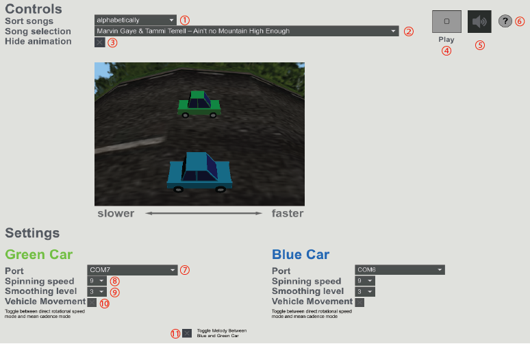

Once you have the MMM Duet System software up and running, you will see the user interface shown above. See the text below for a detailed description of each element (referenced by a red circled number). 

1. **Sort songs dropdown**: Change how the list of available songs is sorted. Sorting options include alphabetically or by year released. 

2. **Song selection dropdown**: Change which song you will play. Clicking on the white arrow will reveal the list of songs that are currently loaded. If you would like to create your own duets from commercially recorded music, please see the folder titled “Creating Duets from Commercial Recordings” on the MMMDuetSystem Git repository.  

3. **Hide animation toggle**: Show or hide the visual animation of each player’s performance speed. See #10 below for more details. 

4. **Play button**: Toggle this button to begin playing. 

5. **Mute button**: Toggle this button to mute/unmute sound. 

6. **Help button**: Press this button to open a help document for guidance. 

7. **Port dropdown**: Select the corresponding ports for each controller (see Bluetooth Port Selection & Parsing for greater detail). 

8. **Spinning speed dropdown**: Select spinning speed level based on device/player performance (see Device Speed Calibration for greater detail). 

9. **Smoothing level dropdown**: Select smoothing level based on player performance (see Smoothing Calibration for greater detail). 

10. **Vehicle Movement toggle**: Toggle this button to switch the vehicles in the visualization between ‘movement based on player rotational speed’ mode and ‘movement based on player’s rotational consistency’ mode. 

## B. Max patch information for researchers and developers
 ### **1. General information about the patch** 
Below is a diagram that shows all the components of the MMMDuet System. Please note that the component labeled “Game Controller Script” refers to the Arduino code that is loaded onto each Arduino. This component is described on the MMM Duet System Hardware page. All other components are included in the Max patch. The Max patch is organized by components with each component being comprised of Max objects, and 0 or more Max subpatches.  Some of the subpatches have subpatches as well. The component diagram below shows the overall organization of the MMM_Patch, the main patch. The text between components (e.g., “< songpic”) indicates variables being passed from one component to another with the bracket indicating the direction of transmission. 

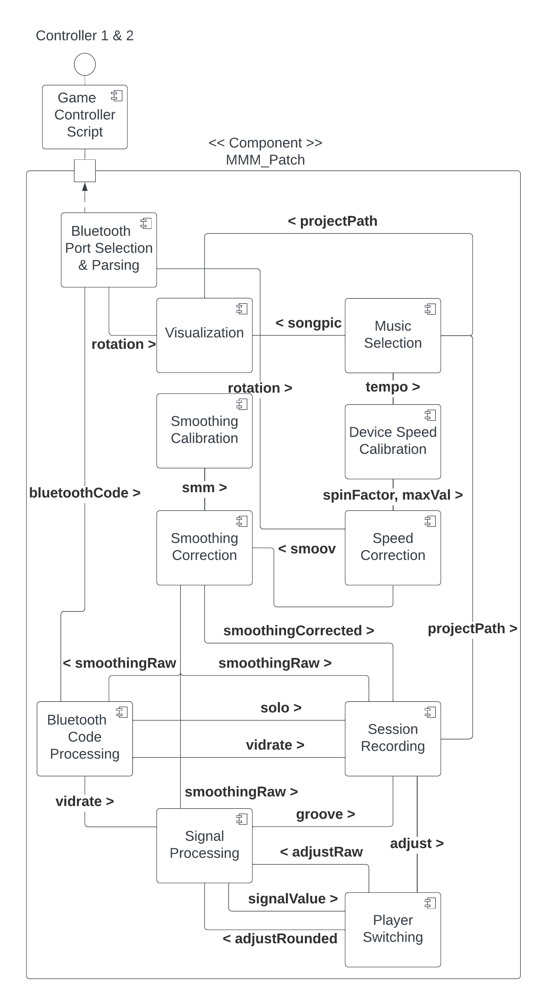
 ### **2. Components** 
 For simplicity, we have grouped the components into three main overarching groups: Input- and Output-related components; Music Selection components, Duet Facilitation components; and Visual components.  

 

## A. INPUT- and OUTPUT-RELATED COMPONENTS: 
The following components deal with input to the Max patch. 
### <u>Game Controller (Arduino) Script </u>

The MMM Patch currently takes the serial output from the microcontroller as its input, but it can take any serial ASCII information as its input as long as it is unsigned (not negative). As the largest bottleneck in the system is between the microcontroller and computer, the information is currently being sent as 2 Byte unsigned integers, but Max can also easily handle 4 Byte unsigned long integers. Each datapoint can either be separated by a space (ascii 32), by a line return (ascii 10), or by a full carriage return (ascii 13 and 10). Some Bluetooth handle these dividers differently, so each of them have been tried to achieve the best latency possible. Different baud rates should also be tested to ensure reduced latency. 

### <u>Session Recording </u>

Currently, whenever the recording function is enabled and a song is played, 4 textfiles are created. One contains the raw data coming from the musicbox1, one the raw data of musicbox 2, another containing the data of musicbox 1 after being smoothed by the smoothing functions, another containing the smoothed data of musicbox 2 (that matches the sounding result of the actions). The raw textfiles are named after the time of the performance, their musicbox # (the left musicbox is musicbox1 and the right musicbox is musicbox2), whether they were in solo or duet mode, the degree of smoothing assistance # during the song, the spinning speed # of that musicbox, and the song number. The smoothed textfiles are the same except they start with the word smooth. In addition to the timing information embedded within each file is each stop-point that has occurred in either partner’s part, and each time that either part has been moved to be realigned the other part.  

### <u>Bluetooth Port Selection & Parsing </u>
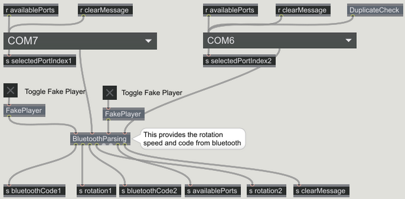 

## B. MUSIC SELECTION COMPONENTS:
The following component helps people to add and select the music of their choice.  

This subpatch uses text files that lists a) the accompaniment wav file of the song b) the melody wav file of the song, c) name of open source image of singer, tempo of song, and year of recording. 

 

For people who want to add their own songs to the system, please go see [Creating Duets from Commercial Recordings](https://github.com/LoehrLab/MMM_Duet_System/tree/main/Creating%20Duets%20from%20Commercial%20Recordings#creating-duets-from-commercial-recordings). 
## C. DUET FACILITATION COMPONENTS:
The following components help players synchronize the duets together. Each component can be set to a different level to adjust duet playing difficulty (making it easier or harder to stay in synchrony with the partner). These components were implemented to allow for satisfying duet performance across a wide variety of individual differences in performance ability (e.g., different musical skills, motor constraints, etc.).  
### <u>Device Speed Calibration (MMM_patch section E)</u>
The subpatch SpinSpeedCalibration serves two functions. 

1. You can manually adjust playback to account for players’ preferred and actual spinning speed Since we want to know the spinning speed of the musicboxes, we measure the time it takes to move from one location on the rotary encoder of the musicbox to the next. Then we take a prechosen numerator to be divided by this length of time to find out the spinning speed. This subpatch uses a range of numerators to match a spinning speed to the intended spinning speed of a player. The larger the numerator used, the slower the spinning speed required to match the original audiofile speed. The spinning speed levels shown on the screen range from 0 to 10, with 0 corresponding to the slowest spinning speed, and 10 corresponding to the fastest. The component uses these levels to choose a numerator to divide the input time from the music boxes.   The ‘normal’ preset numerator is 40, but numerators range from 17 – 190 (17, 20, 25, 30, 35, 40, 60, 80, 110, 150, 190). Also, the greater the numerator (the slower the spinning speed), the greater the need for smoothing.  

2. Adjust playback to account for the original tempo of the song. This subpatch also includes a function that takes the average tempo of the song and adjusts the spinning speed slightly to match the tempo (seen as the speechbubble input ‘Tempo’), increasing the spinning speed required for faster songs, and decreasing the spinning speed required for slower songs. 

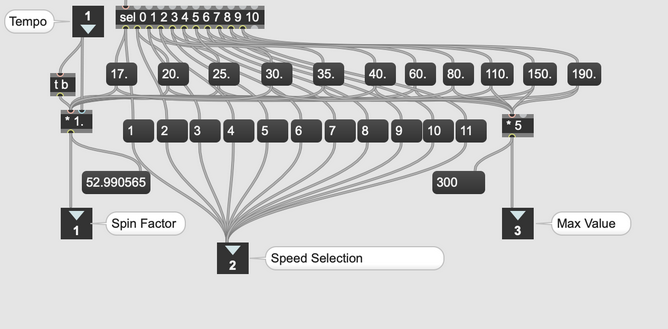

### <u>Speed Correction (Smoothing Lvl 1) - (MMM_Patch section F)</u>

A large role of the subpatch Smoov is to protect against dividing by zero. This subpatch uses a feedback loop to diminish the distance of outlier datapoints from the mean. In essence, it keeps a running mean of the last 100 datapoints in order to bring the newest datapoint closer to the running mean. This subpatch was especially important in the early versions of the patch where we were inputting rotational information into the MMM Patch. As we improve the regularity and latency of the input to the MMM Patch this subpatch will become less important, and its aggressiveness should be adjusted accordingly. 

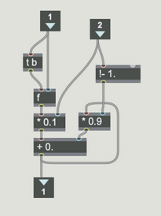

### <u>Smoothing Correction (MMM_Patch Section H)</u>

The purpose of the SmoothingFunction subpatch is to smooth the speed of their musical output relative to the player’s spinning speed. With no smoothing, the speed of the musical output varies with the speed of the player’s spinning. With high levels of smoothing, the speed of the musical output remains stable even if the player’s spinning speed is variable. 

SmoothingFunction is based on variations of the mathematical formula y = (x - 1)n/m + 1. This pushes players towards the correct speed (1,1) in order to help them match the original audiofile speed. There is also a limiter at the top, to stop the function from getting out of control when it is spun too fast. Here is an example of a smoothing function for smoothing level 0. 
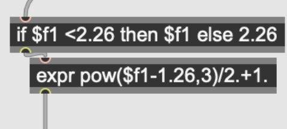

Different levels of smoothing vary the m and n of the above function. Here is an image of the resultant curves (black, level , has the least amount of smoothing while red, level 7, has the most) : 

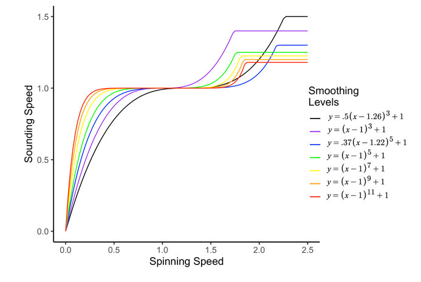

### <u>Automatic realignment (MMM_Patch Section A, component Auto-adjust):</u>

The purpose of the Auto-adjust subpatch is to allow for automatic realignment of the two players’ parts if they drift so far apart that they are unlikely to be able to realign with each other simply by adjusting their own spinning speeds. Feedback from early users indicated that moving the accompaniment part to the melody part is less noticeable, so this is always done. Currently, whenever the participants get off by more than 1.5 seconds (66150 samples at 44100) the parts are automatically realigned. The parts are also realigned whenever the parts get off by over 1 second (44100 samples) for 1 second, and off by over .5 seconds (22050 samples) for over 2 seconds (It may appear that the < sign is reversed for these 2 in the patch but they are correct as clocker restarts every time it is banged). The musicbox that has the melody part is known through the r lr function. 
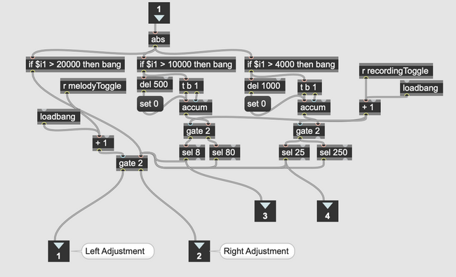

In terms of technical implementation of this function, the current sample of the audiofile can be known by tracking the sig~ function, (this tracking is shown in section I. Player switching), summing the samples that have occurred in the signal accumulator, and taking snapshots of this running total. These snapshots are then shown in message boxes (NB: mbox 1 snapshot is shown on the right of the patch while mbox 2 is shown on the left – this has been done as the value in these message boxes become the new value for the other part when realignment is done). E.g. When a realignment request is made to move mbox1 to mbox2, the current sample of mbox2 is fed back into the signal accumulator (**+=~**) of mbox1.  

### <u>Bluetooth Code Processing (MMM_Patch Section J):</u>

As the patch doesn’t really know the spinning speed of the musicboxes, it doesn’t really know when players have stopped mid-song. All the MMM patch has is the latest information given to it, which is the last duration recorded between the last 2 points it has seen from the musicbox (which it estimates the current speed from – see spinning speed above). Therefore, an audio-off has been added to allow the audiofile to stop playing when it hasn’t received any new input information. The component takes the smoothingRaw value and outputs it as audio-off. When the player is spinning, they are the same. After 320 msec of inactivity, the controller sends a the ASCII characters “/D”. After 640 msec, the controller sends out “/E”. After another 320 msec, at 960 msec, the controller sends out “/F”. The MMM Patch registers this as the ASCII numbers 68, 69, 70 respectively.  When 68, is received, the last smoothingRaw value transitions to 0.3 over 330 msec becoming vidrate. When 69 is received, it transitions from 0.3 to 0. When 70 is received, nothing happens, but this functions to stop the repeated triggering of the transition from 0.3 to 0. 

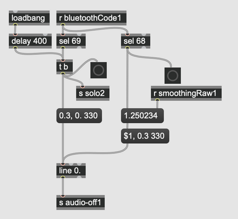

### <u>Signal Processing Component (MMM_Patch Section K):</u>

It takes all of the inputs from the components described above (e.g., speed calibration, smoothing correction, song selection, etc.) and uses that information to add the song to the player and adjust the speed and amplitude of the audio file in the music player. 

One aspect of the Signal Processing component that hasn’t been described elsewhere is a function that makes continual slight adjustments to the amplitude of the audio output tied to speed of the spinning, that is, the faster the spinning, the louder the output”. This follows the idea of a transfer of energy from speed into volume, so that people can still feel that their quick actions are being responded to, even if it is not reflected in large quick changes in speed. This is implemented in the Signal Processing component. 

## C. VISUAL COMPONENTS:
The following components allow the users to display, or not, visual feedback about how well their performances are aligning together. 

### <u>Visualizations (MMM_Patch Section B):</u>

Early users sometimes over-focused on the visual performance feedback to ensure they were doing the task ‘correctly’, and found that this interfered with ability to enjoy performing the duets with their partner. This subpatch offers users the option was added to hide the dynamic visual feedback from the screen and instead display a static image. This is either activated through a toggle or through a keyboard shortcut. The static image is determined by the file specified in the Song Library files (see Song Library section below). 

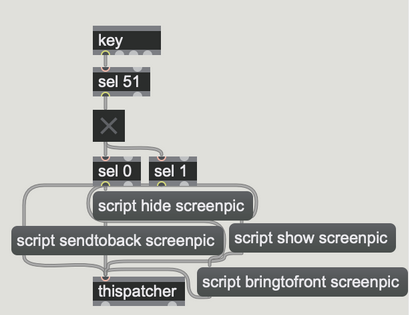

### <u>Auto Solo or Duet mode (p practice): </u>

The dynamic visual feedback works either as a comparison between a player and the original song speed (solo mode) or as a comparison between a player and their partner. This function borrows from the auto-stop function to know whether both players are playing or not. The default state is duet mode, but it moves the visual feedback into solo mode when one of the players has not been heard from in over 660 msec. Similar to the auto-stop function, duet mode is reactivated immediately as soon as there is feedback that both players are playing at the same time. 

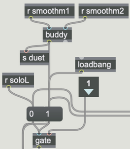

### <u>Visualization: </u>

The visualization in the system is governed by the VideoControl subpatch. In the E. Vehicle Position & Attributes subcomponent, the rotational speed of the player, along with the rotation1 and rotation2 variables, is converted into a percentage of the 40 msec, the time limit set in the controller script. This percentage is then subtracted from 1 to obtain the rotation ratio, where the maximum speed is 1 and the minimum speed is 0. 

The rotation ratios from both controllers are combined and sent to the G. Road Position and Rotation subcomponent as the jointRotation variable. Here, a rolling average of the most recent 10 jointRotation values is computed, which is then translated into a rotation of the road and background. 

The individual performance of the player, as represented by the rotation ratios, is evaluated by the PlayerStatistics subpatches. Two performance indicators are calculated using different methods: 

- Direct Rotation Method: This method computes a rolling mean, variance, and standard deviation of the most recent 50 rotation ratios. The rolling mean is used to determine the position of the player, which is adjusted to the left side of the visualization when no rotation is recorded. 

- Cadence Method: This method builds on the Direct Rotation Method by maintaining a resting mean value that is updated when the current rolling mean is outside of 1 standard deviation from the previous resting mean. The current rolling mean is then compared to the resting mean, and the vehicle moves forward if the player is slightly faster than the resting mean, while it stays centered if the player rotates at a consistent speed or not at all. 
